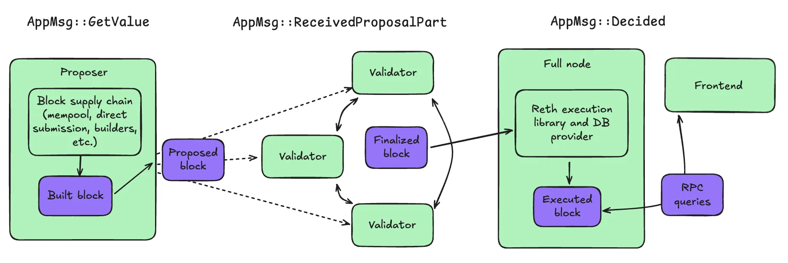

# 42,000tps with Reth and Malachite

At Informal, we’ve been exploring how to integrate Malachite, our cutting-edge Tendermint-based consensus protocol with Reth, one of the leading Ethereum execution clients. Both codebases are built in Rust, so integration is pretty natural.

Malachite provides consensus, and so far has been benchmarked at a throughput of 13.5MB/s in a 100 validator network (although improvements far beyond this are under development). The concept is pretty simple. There is a validator set which controls the network. Every block, one of the validators is chosen to act as the proposer. This proposer creates a block and streams it to the rest of the validators in the network. Once a validator receives and reconstructs the block, they follow the Tendermint consensus protocol to vote on their approval of the block and propagate the vote to the other validators and clients. When a client or validator sees that a given block has received votes from at least 2/3s of the validator set, the block is considered final.

## Running the demo

First, run `cargo run --bin utils -- generate`. This generates blocks of transactions and stores them on disk for nodes to propose.

Then, run `rm -rf ./nodes; cargo build; cargo run --bin malachitebft-reth-app -- testnet --nodes 3 --home nodes; bash scripts/spawn.bash --nodes 3 --home nodes --rpc-node 0`. This command cleans up any old testnet and starts a new one with three nodes, with node 0 executing blocks and acting as an RPC node.

To view the logs, run `tail -f nodes/0/logs/node.log`.

To verify that the blocks are being executed correctly, wait for 11 or 12 blocks to be produced, then run `cargo run --bin utils -- verify`. This script will check that balance changes indicate that blocks have been executed properly.

## Architecture

Malachite provides a relatively easy interface to the consensus protocol using a channel abstraction with message handlers. To integrate Reth’s execution libraries with Malachite, we wrote message handlers for a few main message types. There are other messages as well, but we will omit them here for brevity.

While the diagram above depicts separate nodes for the proposer, validator, and full node roles, they are all handled in the same codebase, and it is possible for one node to perform all three roles at once.

You can see all the message handlers in `app/src/app.rs`

### 1. AppMsg::GetValue

This relates to proposing blocks. Malachite is literally asking the application to get a value to propose. Traditionally this has been done by reaping from a shared mempool, but many modern high performance blockchains do not get blocks this way, instead relying on 3rd party builders like Ethereum, or direct submission of transactions to the next proposer, like Solana. To keep things simple, the nodes in our example app just read transactions from disk.

From here, the proposer does two things. First, it sends the block’s hash into the consensus protocol, to get the round started, while simultaneously streaming block parts to all the other validators.

### 2. AppMsg::ReceivedProposalPart

Malachite sends this message to the application whenever a part of a streamed block is received from the proposer. The application reassembles the parts in order and when the full block has been received, replies to Malachite to let it know it is OK to finalize the block. Malachite then handles execution of the Tendermint consensus protocol and communicates with the other validators to circulate its vote.

It’s important to note that in the example as currently written, the validators do not execute the block, and so are not validating the correctness of the transactions, but just their order. I would describe this as a “lazy ledger” approach, and has the benefit potential increased throughput and not tying validators to any one block execution implementation.

The lazy ledger approach has the downside of requiring every client to re-run transactions themselves instead of being able to trust the validators about execution results.

In any case, to switch to a validator execution approach, we would simply need to have validators execute the block in this step after reconstructing it.

### 3. AppMsg::Decided

Malachite sends this message to tell the application that a block has been finalized because more than 2/3 of validators have voted for it.

At this step, most of the Reth integration comes into play. By importing Reth’s internal libraries, we were able to create a BlockExecutor which runs transactions in the block through the EVM to produce a final application state, and commits that application state to a database. The RPC server is then able to serve queries against that state to clients.

## Performance

This demo achieves a throughput of 10MB/s second by finalizing one 10MB block per second. The blocks contain 42,000 send transactions. The Reth libraries in the client node are able to handle execution of these transactions quite quickly, but if we were using normal EVM traffic with contract calls, the client might fall behind consensus.

## Limitations/Todo

This is a rough proof of concept demo, and there is still much to build.

- **Generalize execution and logging:** Currently, the code has hardcoded logging designed for the express purpose of validating the expected execution of many transfers from one account each block.
- **Fix RPC server:** The RPC server is able to correctly respond to balance queries, but is not able to correctly display block numbers and other information. This is probably just due to misconfigurations we have not had time to fix for this demo.
- **Test with more diverse transaction loads:** Currently we are just using send transactions. Ideally we would use a realistic mix of sends, contract calls, contract deployments, etc.
- **DOS vulnerabilities:** This example is currently vulnerable to attacks such as a malicious proposer streaming a huge number of block parts, filling every other node’s memory and storage, and crashing the network. It needs to be hardened against this.
- **State sync:** Currently the demo is set up to execute blocks when they are finalized, but not to sync and execute old blocks if a node has been offline for a time.
- **Consensus hang:** Consensus hangs sometimes. This is probably easy to fix.
- **Better automated test suite:** Currently, the network is tested with manual or automated inspection of the logs. Many of the issues above would be easier to fix if there were an automated test suite validating these scenarios.
